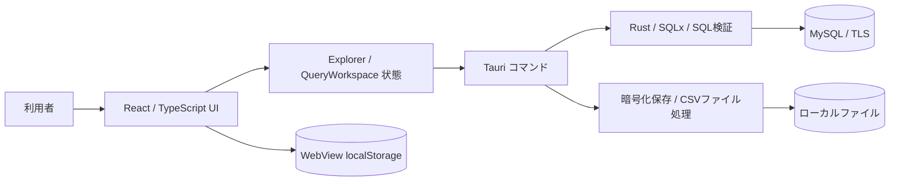
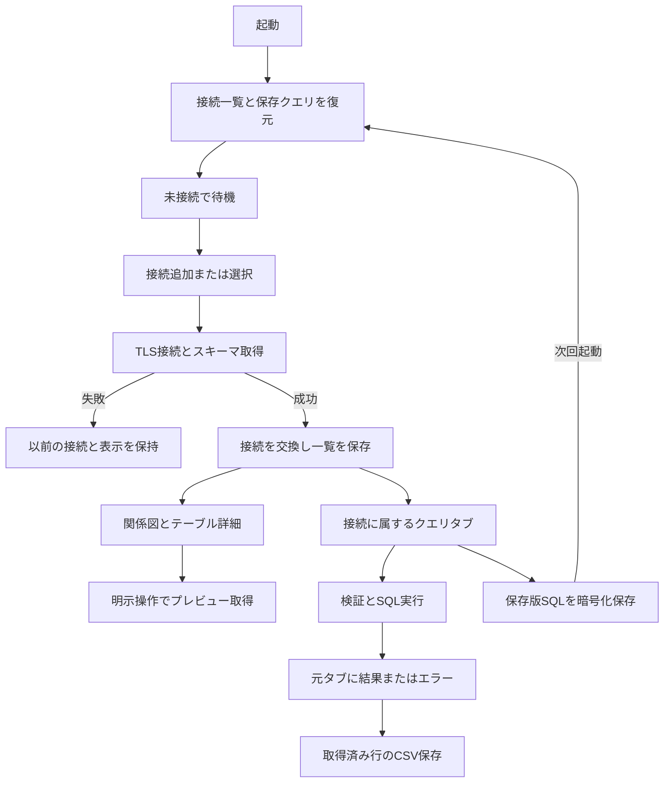

# 基本設計：システム概要・構成

[設計書目次](../README.md) / [機能一覧](features.md)

## 目的・対象

RelaGridはMySQLのテーブル・カラム・外部キーを動的に読み取り、関係図とデータプレビューで探索し、別画面でSQLを実行するWindowsデスクトップアプリである。想定利用者は接続先DBの資格情報を持つ開発・保守担当者。役割別のアプリ認証、組織の業務目的、性能SLAは定義されておらず要確認。

MySQL 8.0を製品対象として記載する。過去検証は8.0.44と26.7.0が混在し、全機能を両方で保証した記録ではない。Windows 10/11・WebView2を前提とし、他DB、Web版配布、アプリ内のユーザー管理、明示的なコミット／ロールバック、CSVからDBへの取り込みは現行範囲外。読み書き接続で単独更新は可能である。

根拠：[製品README](../../README.md)、[App](../../src/app/App.tsx) `App`、[Tauri設定](../../src-tauri/tauri.conf.json)、[Cargo定義](../../src-tauri/Cargo.toml)。実装済み機能は[機能一覧](features.md)を正とする。

## 構成と責務

| 層       | 責務・境界                                                                                                                            |
| -------- | ------------------------------------------------------------------------------------------------------------------------------------- |
| UI       | React、CodeMirror、React Flow、Radixで入力・表示・確認・ショートカットを提供。DB資格情報と取得データは実行中メモリに存在する          |
| 状態     | `useExplorer`が現在接続・スキーマ・プレビュー、`QueryWorkspace`がタブ・結果・履歴を保持。画面切り替えでワークスペース状態を破棄しない |
| IPC      | `src/data`のGateway・storeとCSV呼出元からRustコマンドへ非同期呼び出し。RustがDB対象や保存先を検証                                     |
| DB       | `AppState.session`は同時に1接続先を保持。SQLxのプールは最大3接続。任意SQLと全件出力はプールから接続を切り離して利用                   |
| ファイル | 接続パスワードはAES-GCM＋DPAPI、保存クエリ全体はDPAPIで保護。CSVは保存ダイアログから選んだ先へ一時ファイル経由で確定                  |
| 設定     | ショートカットはWebViewのlocalStorage。接続／クエリ保存ファイルとは別管理                                                             |

根拠：[Gateway](../../src/data/tauri-gateway.ts) `mysqlGateway`、[Rust入口](../../src-tauri/src/lib.rs) `AppState` / `run`、[共通状態](../detailed-design/shared-components.md)。中間HTTPサーバーは置かない。Viteは開発用UIサーバーと配布UIのビルドに使用する。

## 主要フロー

接続成功は「新しいプールとスキーマを取得できた」時点で判断する。その後の接続一覧保存に失敗しても接続自体は維持する。起動時は保存接続に自動接続しない。

SQL実行はUIとRust双方で多重実行を制限する。実行中も編集・タブ／画面切り替えは可能だが、接続変更は待つ。読み書き接続の通常実行では確認ダイアログを経由する。保存したSQLだけを次回復元し、未保存編集・結果・履歴は復元しない。

テーブル全件CSVはプレビューを拡張して出すのではなく、カタログ由来のSELECTを別に実行する。[SQL実行](../detailed-design/sql-execution.md)、[保存・復元](../detailed-design/query-management.md)、[CSV](../detailed-design/results-and-export.md)に異常系と排他を示す。
