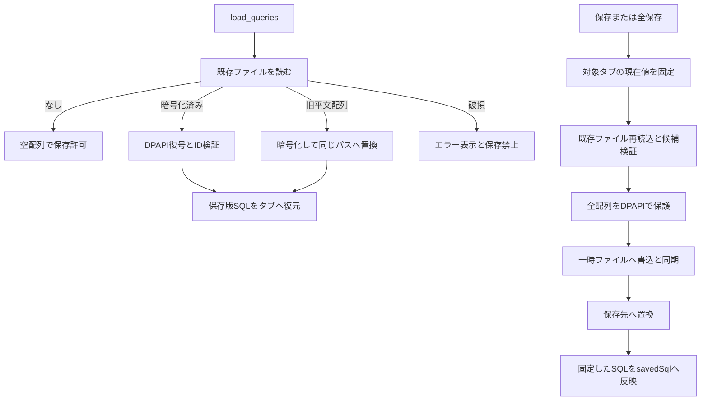

# 詳細設計：SQLエディタ・クエリ保存・履歴

[設計書目次](../README.md) / 対応機能：F-08〜F-10

## 責務・入出力

[QueryWorkspace](../../src/features/query/QueryWorkspace.tsx)が `QueryTab` / `Execution` / `ResultView` を所有する。入力propsは現在のconnectionId/label/readOnly、tables/selected、busy、active、execute/cancel関数。未接続のconnectionIdは0。結果・表示状態は親のタブ状態へ格納する。

[SqlEditor](../../src/features/query/SqlEditor.tsx)はvalue:string、tables:Table[]、onChangeを受け、CodeMirrorを生成・破棄する。[sql-assistance](../../src/features/query/sql-assistance.ts)は `sqlCompletions` / `columnsForQualifier` / `typeDiagnostics` を提供する。[query-store](../../src/data/query-store.ts)と[query_store.rs](../../src-tauri/src/query_store.rs)がSavedQuery配列の保存境界。

## タブの生成・接続所有・終了

`createTab` は採番id、`Query id`の名前、sql、savedSql空、現在接続、結果表示result・index0・空viewsを設定。初期タブid1、次id2。新規SQLは選択テーブル（なければ先頭テーブル）の `SELECT * FROM 引用テーブル LIMIT 100;`、テーブルなしの接続済みはSELECT 1、未接続なら空文字。

接続切り替えは保存読込完了後に処理する。未接続所属（0）のタブがあると新接続へ割当て、既存SQLを維持する。保存済みの空SQLも維持し、未保存で空のものだけ初期SQLを入れる。それ以外では同じconnectionIdの先頭タブを選び、なければ作る。切断でも既存タブを消さず、0のタブを選択／生成する。

別接続タブは編集・結果閲覧・保存可能。実行は現在接続と一致が必要で、暗黙の再接続はしない。タブにあるreadOnly/labelは所有時の値で、実行の許可は現在接続とRust Sessionのread_onlyで決める。

`sql !== savedSql` が未保存判定。終了時は実行中／保存中なら何もしない。未保存なら[CloseQueryDialog](../../src/features/query/CloseQueryDialog.tsx)を開き、破棄で終了、取消で保持する。アクティブタブを閉じると残りの先頭を選択。最後のタブは新しいIDの空タブに置き換える。終了は保存済みクエリのファイル削除ではない。

## エディタ支援

MySQLハイライト、行番号、Undo、対応括弧、アクティブ行。Tabは候補確定、Mod+Spaceは候補表示、候補がなければ通常インデントに進む。SQL全文実行のキーはワークスペース側に集約し、CodeMirrorから二重実行しない。

補完はキーワード・組み込み型・テーブル名と、修飾子に対応するカラムを返す。独自トークナイザで文字列・コメント内を除外し、別名、CTE、派生表、相関サブクエリ、UNIONのスコープを解析する。`query` の解析深さは40を超えると打ち切る。予約語や特殊な列名を引用する。別接続タブには現在DBのtablesを渡さない。

型診断はCREATE TABLE、ALTER TABLE、CAST、CONVERTの型名を検査し、350ms遅延で診断を更新する。汎用SQLの完全な構文検証やサーバー互換性保証ではなく、診断があってもそれ自体で実行を禁止しない。実行前検証はRustの責務。

タブを切り替えるとkey=tabIdでCodeMirrorを作り直す。SQL本文は保存されるがカーソル・選択・Undo履歴をタブ別に復元する実装はない。SQL画面を離れて戻る場合もエディタは再生成する。

## 保存・復元フロー

起動時、load成功で `savedQueries` とタブを復元しnextIdを最大ID+1へ、最初の保存タブを選ぶ。savedSqlをsqlと同じにする。読込エラーは `storeLoaded=true` にして編集画面を利用可能にするが `storeReady=false` のまま保存を禁止する。

`save(all=false)` はアクティブタブ、trueは開いている全タブのid/name/sql/所有接続を固定する。既存保存一覧から同じIDだけ置き換え、閉じた保存項目を残す。同期ref `saving` で多重保存を防ぐ。成功時に固定したSQLをsavedSqlへ反映するので、保存中の新しい編集は未保存のまま。失敗はstorageErrorへ、savedSqlを更新せず再試行できる。成功通知は4秒または手動で閉じる。

Rustは `relagrid-queries-v1-dpapi` のenvelopeを保存し、SQLだけでなく名前・接続表示名など配列全体を保護する。IDは正のu32かつ一意。SQL構文やサイズ、connectionIdの実在は保存条件ではない。旧平文配列は読込時に暗号化して置換し、移行失敗時は成功として返さない。暗号化前の一時ファイルは作らない。詳細は[データモデル](../basic-design/data-model.md)。

保存はローカルファイルの副作用のみでDB操作・トランザクションは該当しない。readiness Mutexと一時ファイル置換を使い、接続保存との横断トランザクションはない。自動保存、定期保存、保存タイムアウト、保存中断APIはない。OSのアプリ終了時に全タブを保存／確認する機能もない。

## 履歴と復旧

実行成功・部分失敗・Promise拒否を `Execution` に記録し、新しい順に最大50件を保持する。時刻は実行応答時に作るローカル表示文字列。SQL・接続・タブIDは開始時の値。履歴クリックはそのSQLと所有接続で新しいタブを作り、再実行はしない。履歴や結果はファイル保存対象外で再起動すると失う。結果を含む履歴にも追加メモリが必要。

## テスト対応

| 観点                                                     | 既存テスト                                                                                                                                                                                                           |
| -------------------------------------------------------- | -------------------------------------------------------------------------------------------------------------------------------------------------------------------------------------------------------------------- |
| 保存／全保存、保存中編集、保存失敗、読込失敗、最後のタブ | [QueryWorkspace.test.ts](../../src/features/query/QueryWorkspace.test.ts) `saves the active query...` / `keeps newer edits dirty...` / `confirms closing the last dirty tab...`                                      |
| 接続所有・未接続SQL保持・履歴・遅延実行                  | 同上 `retains disconnected saved SQL...` / `retains SQL and results across connections...`、[saved-queries.spec.ts](../../tests/saved-queries.spec.ts)                                                               |
| 補完スコープ・型診断・引用・コメント                     | [sql-assistance.test.ts](../../src/features/query/sql-assistance.test.ts)、[query.spec.ts](../../tests/query.spec.ts)（実CodeMirror、IPC模擬）                                                                       |
| 暗号化、旧配列移行、破損保持、置換不可                   | query_store.rs内 `encrypts_all_fields_and_migrates_without_plaintext_temporary_files` / `failed_migration_preserves_plaintext_and_removes_temporary_file` / `structurally_valid_but_invalid_ids_are_not_overwritten` |
| 実IPC・保存・画面再読込                                  | [native-query-smoke.mjs](../../tests/native-query-smoke.mjs)（QAプロファイル用）                                                                                                                                     |

保存先が異なるWindowsユーザー、実ディスク不足、複数プロセス同時保存、アプリ強制終了の完全な復旧は今回未検証。保存ファイルの修復・削除を自動で行う仕様はない。
